# We Built a Real-Time ASL Translator That Runs on a Laptop. No GPU. No Cloud. No Gloves.

*By Radhika Khurana, Jian Gao, Hrishikesh Pradhan, and Gyula Planky — Northeastern University, Applied Deep Learning, Spring 2026*

---

Over 70 million people worldwide use sign language as their primary language. Not as a backup. Not as a supplement. Their first language.

And yet every AI system that can recognize sign language at a competitive accuracy requires a dedicated GPU to run. That rules out every laptop, every phone, every hospital kiosk, every school computer. The models exist. The papers exist. The deployments don't.

We wanted to change that. Over one semester, we built a system that recognizes **1,896 American Sign Language words in real time**, running entirely on a CPU, using nothing but a webcam. No special hardware. No internet connection. No gloves.

This is the full story — from raw data to deployed model — including everything that didn't work and why.

---

## The Problem: Why Sign Language AI Is Inaccessible

The state of the art in sign language recognition uses models like **I3D**, **SlowFast**, and **VideoMAE**. These are powerful. They process raw RGB video through deep 3D convolutional or transformer architectures and achieve competitive accuracy.

They also require a dedicated NVIDIA GPU to run in real time. I3D processes 6.2 million pixels per frame across 30 frames per second. That's 186 million pixel values per second, each passing through a 12-layer 3D convolutional network. No laptop CPU handles that at real-time speed.

The result is that the most capable ASL recognition models are locked behind hardware that most people don't have — the exact people who would benefit most from ASL tools often can't afford dedicated GPU workstations.

Our goal: **match or beat GPU video models on accuracy, while running entirely on CPU, with no raw video processed or stored.**

---

## The Core Insight: The Pixels Don't Matter. The Hands Do.

When you sign, your background doesn't sign. Your shirt doesn't sign. Your lighting conditions don't sign. Your **hands** sign.

A human signs with hand shape, hand position, hand movement, and hand orientation — all encoded in the geometry of 21 landmarks per hand. That geometry is the sign. Everything else is noise.

We use **Google's MediaPipe HandLandmarker** — a real-time computer vision system — to extract exactly those landmarks. MediaPipe detects your hands in each frame and returns the 3D coordinates (x, y, z) of 21 landmarks per hand. Two hands × 21 landmarks × 3 coordinates = **126 numbers per frame**.

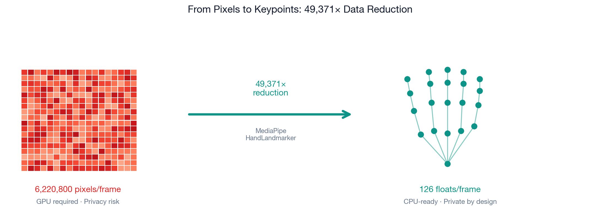

Compare: a 1080p video frame has 6,220,800 values. We keep 126. That's a **49,371× reduction in data volume**. And we lose nothing that's semantically meaningful — the geometry of the hands is the sign.

There is also a privacy benefit that matters for real deployment. We never store raw video — only keypoints. A sequence of floating-point hand coordinates is meaningless without the extraction model. No identifiable footage is retained at any point in the pipeline.

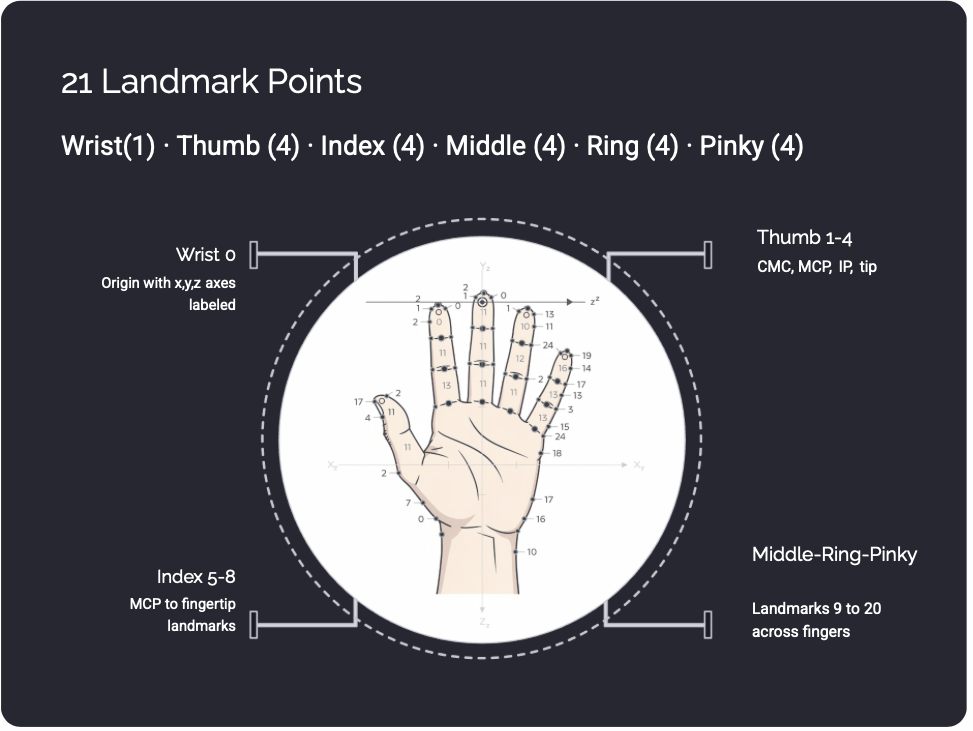

MediaPipe runs at roughly 8ms per frame on a CPU. That means hand detection takes about 8ms and model inference takes 0.6ms — the detector is the bottleneck, not the classifier.

*This keypoint extraction pipeline was designed and built by **Jian Gao**.*

---

## Building the Dataset From Scratch

No single clean ASL dataset existed at the scale we needed. We aggregated three sources, each with very different characteristics.

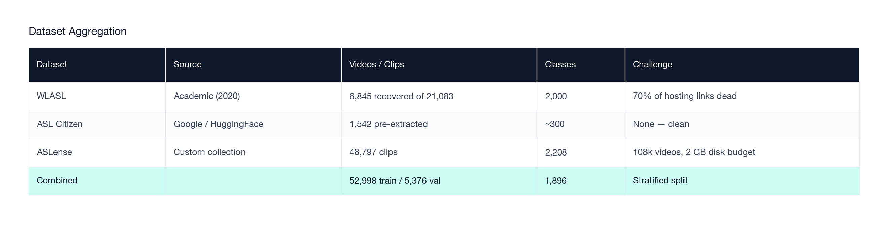

**WLASL** was the most well-known academic ASL dataset — and effectively unusable at scale. The original paper linked to YouTube and Vimeo videos that have since been taken down. We recovered 6,845 of 21,083 videos — a 32% survival rate, six years after publication. This is a real reproducibility problem in this research area that nobody talks about enough.

**ASL Citizen** was the cleanest source: pre-extracted pose sequences from a Google-backed collection hosted on HuggingFace. No download issues.

**ASLense** was the largest by far: 108,000 raw videos. We processed them overnight in batches, extracted keypoints with MediaPipe, and deleted each raw video immediately after extraction to stay under a 2GB disk budget. The final keypoint files were 2.7GB total.

### Why 1,896 Classes?

Vocabulary size is a fundamental tradeoff. More signs means better coverage but fewer training examples per sign, which makes learning harder.

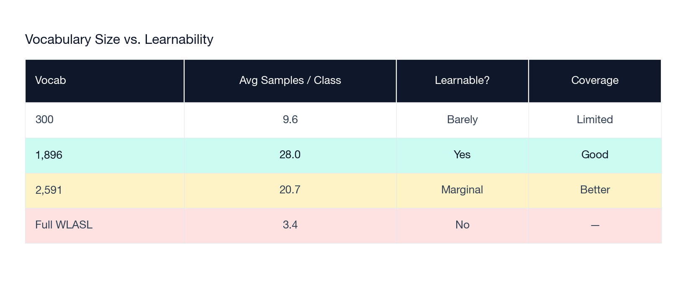

We tested several cutoffs. At 2,591 classes, accuracy dropped ~4 points in early training epochs because average samples per class fell below the threshold where the model could generalize. At 1,896 classes, we hit 28 samples per class on average — the minimum viable density. 96% of classes have at least 10 examples, and 449 classes have 30 or more.

Even at 1,896 classes, the distribution is heavily imbalanced — common signs like HELLO have hundreds of clips, rare signs have a handful. We handle this with **WeightedRandomSampler** (explained in the training section).

The validation split is stratified: **5,376 samples** held out with coverage across all 1,896 classes.

*Dataset engineering was led by **Jian Gao**.*

---

## The Full Pipeline: Webcam to Prediction in Under 25ms

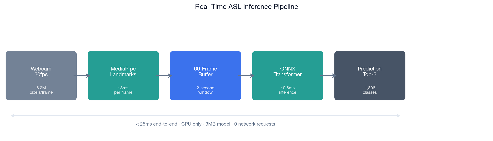

Here's what happens from the moment you sign to the moment the word appears on screen:

1. **Webcam** captures a frame at 30fps
2. **MediaPipe** detects both hands and extracts 126 keypoints per frame (~8ms)
3. **60-frame rolling buffer** accumulates the last 2 seconds of hand motion; frames are zero-padded if hands aren't detected
4. **Every 0.5 seconds**, if the buffer has at least 50% valid hand detections, the ONNX model runs inference (~0.6ms)
5. **Softmax output** is checked against a confidence threshold
6. **Majority vote** across 5 consecutive inferences: the word is only committed if the same prediction wins 3 of 5 times
7. **Predicted word** is displayed with confidence percentage

Four stability guards keep the output from flickering:

- **Hand ratio gate** — ≥50% of the 60 buffer frames must have hands detected before inference runs at all. No hands = no prediction.
- **Confidence threshold** — tunable via `--threshold` flag; default prevents low-confidence guesses from appearing.
- **Reset on absence** — 20 consecutive frames without hand detection clears the buffer and history. Gives you a clean slate between signs.
- **Majority vote** — smooths over noise in any single inference pass.

The total pipeline latency is **under 25ms** end-to-end, entirely on CPU. The 3MB ONNX model file fits on any device.

---

## Three Architectures, Three Lessons

Before landing on our final architecture, we systematically compared three approaches. This work was led by **Hrishikesh Pradhan**.

### Architecture 1: 1D CNN — Fast, But Blind

A **1D convolutional neural network** treats the keypoint sequence like a 1D signal and applies sliding windows of filters across time.

Concretely: a filter of kernel size 3 looks at 3 consecutive frames at a time, detects a local pattern (like "finger moving inward"), and passes that signal forward. Stack 4 residual blocks and the model can see patterns up to about 21 frames back.

```
4 × residual blocks
kernel = 3, stride = 1
receptive field: ~21 frames
Parameters: ~656K
```

The CNN is the fastest model (~2ms inference) and does surprisingly well given its simplicity — **38.4% Top-1** — because many sign features are local. But it has a fundamental ceiling: it can't see patterns that span the full 60-frame window. A sign where the meaning depends on where you *started* relative to where you *ended* is invisible to a CNN.

### Architecture 2: BiLSTM — Memory, But Bottlenecked

An **LSTM** (Long Short-Term Memory) is a recurrent neural network with an explicit memory mechanism. At each frame, it decides what to remember, what to forget, and what to output — updating a "hidden state" vector as it processes the sequence.

**Bi-directional** means it reads the sequence both forwards and backwards before classifying, so it knows how the sign ends when it re-evaluates how it began.

```
2 × stacked layers
hidden = 128 per direction → 256 combined
Bidirectional pass
Parameters: ~1.1M
```

With augmentation, the BiLSTM scores **31.5%** — actually worse than the CNN's 38.4%, despite having explicit temporal memory. Without augmentation it recovers to ~67–68%, edging out the CNN (~62%), because augmentation corrupts the precise geometry the LSTM depends on even more than it corrupts the CNN's local patterns. Either way, it hits a fundamental bottleneck: **everything the model knows about a 60-frame sign has to fit into 256 numbers** before the classifier sees it. That's the hidden state. When you're distinguishing 1,896 signs, compressing all sign information into a 256-dimensional vector loses too much.

### Architecture 3: Transformer — Full Context, No Bottleneck

A **Transformer** does something fundamentally different. Instead of processing the sequence left-to-right like an LSTM, it reads all 60 frames **simultaneously** and computes relationships between every pair of frames at once.

This is called **self-attention**. Here's the core idea in plain terms:

> Frame 22 gets to ask: "which other frames in this sequence are most useful for understanding what's happening at frame 22?" Frame 1 might answer "very relevant" (because the sign's starting position gives context). Frame 30 might answer "somewhat relevant." Frame 47 might answer "not at all."

This happens for every frame simultaneously, through a learned function. The model learns which frames inform which other frames based on the training data — not from any hand-coded rule.

We use **4 attention heads** — four independent sets of attention weights that learn different aspects of sign structure simultaneously:

- One head might specialize in **handshape transitions** — when do the fingers change configuration?
- Another in **global arm trajectory** — where does the dominant hand travel across the sign?
- Another in **motion onset** — when does movement begin?
- Another in **release patterns** — how does the sign end?

None of this is specified in the architecture. The heads learn their specializations through gradient descent.

**72.8% Top-1.** No bottleneck. Full context. Parallel computation.

---

## What the Model Actually Pays Attention To

We can directly inspect what the Transformer learned to pay attention to by looking at its attention weight matrices — which frames it weights most heavily when classifying each sign.

### FRIEND

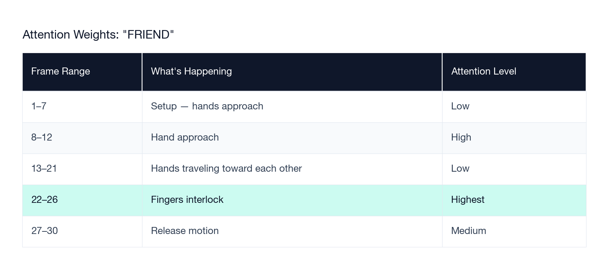

The model has learned that the interlocking of fingers at frames 22–26 is the defining moment of FRIEND. The approach and release are context — the interlock is the sign.

### AIRPLANE

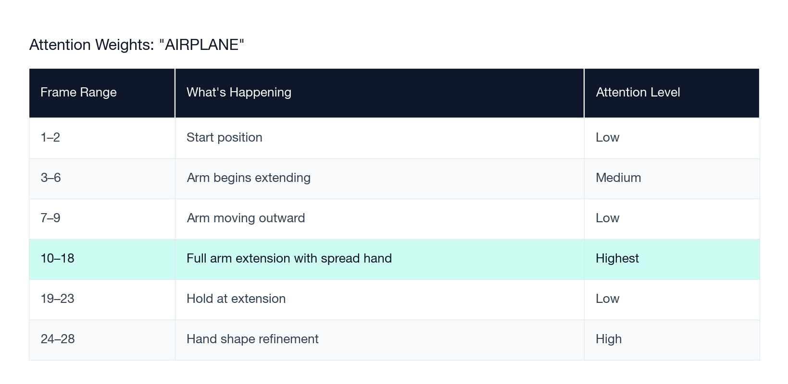

For AIRPLANE, full arm extension (frames 10–18) is the discriminative moment. The approach doesn't matter. The hold after extension doesn't matter. The specific instant of full extension with the spread hand is the sign.

**The key point**: the model discovers these temporal landmarks automatically, from data alone. Frame 22 matters for FRIEND and is irrelevant for AIRPLANE. The same model learns both attention profiles through training — no hand-coding required.

This analysis was conducted by **Hrishikesh Pradhan**.

---

## Model Architecture: Every Design Choice

Here's the full architecture of our best model:

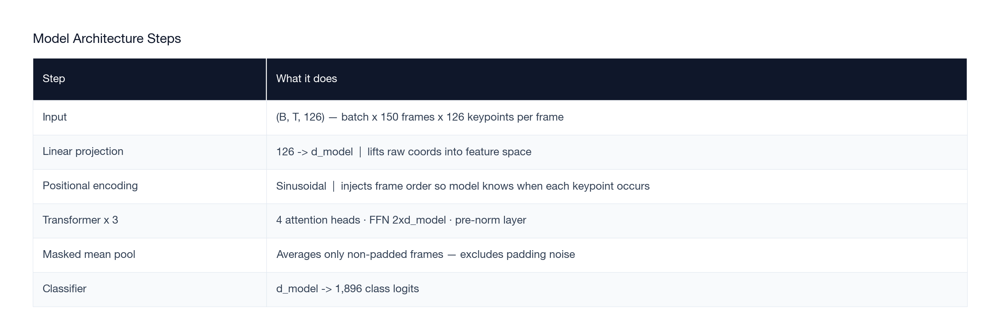

### Why sinusoidal positional encoding?

A Transformer processes all frames in parallel — which is what makes it fast, but it means **frame 1 and frame 60 look identical** to the model unless you explicitly tell it where each frame sits in the sequence. Positional encoding adds a unique signal to each frame position so the model knows *when* each keypoint measurement was taken.

We use sinusoidal encoding (from the original "Attention Is All You Need" paper) rather than learned position embeddings. Sinusoidal encodings generalize better to sequence lengths the model hasn't seen during training — important when signers vary in their signing speed.

### Why masked mean pooling?

After the Transformer processes all frames, we need to collapse the sequence into a single vector for classification. Three common approaches:

1. **CLS token** (BERT-style): prepend a special token, classify based on its final embedding
2. **Last-frame**: use only the final frame's embedding
3. **Mean pooling**: average all frame embeddings

But signs don't end at a consistent frame — shorter clips are zero-padded to 150 frames. Both CLS token and last-frame pooling include padding noise in their representations. We pool over only the **non-padded frames** (masked mean pooling), giving a clean whole-sign average. This was the most stable approach in our experiments.

*Model architecture designed by **Radhika Khurana**.*

---

## Training from Scratch: 5 Models, 5 Hard-Won Lessons

We didn't start with the right setup. Here's the full experimental progression:

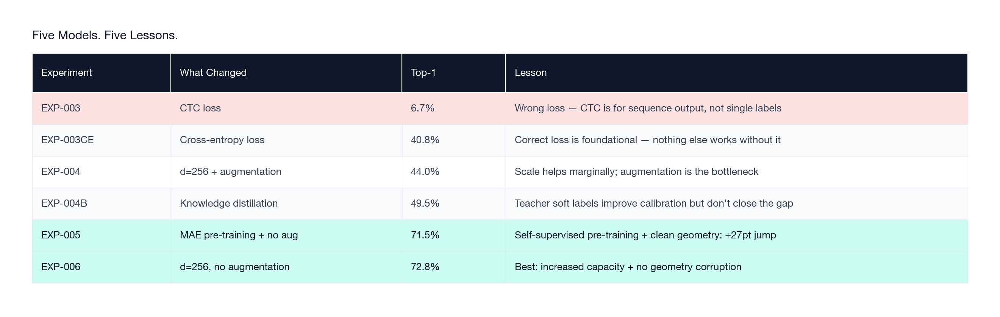

The biggest single lesson is buried in the jump from EXP-004 (44.0%) to EXP-005 (71.5%): **removing augmentation contributed +27 percentage points**. That single training decision — stopping something we were doing — was responsible for most of the model's final performance. The augmentation section below explains exactly why.

---

## Training Setup: Every Hyperparameter and Why

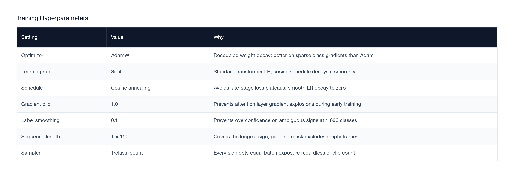

### What is cross-entropy loss?

Every training step, the model outputs 1,896 numbers — one for each sign — that represent its confidence in each prediction. A softmax function converts these into probabilities that sum to 1.

**Cross-entropy loss** measures how wrong the prediction was. If the correct sign is FRIEND and the model says "0.9 probability of FRIEND," the loss is very small. If it says "0.001 probability of FRIEND" and was very confident about the wrong sign — the loss is enormous.

Mathematically: `loss = -log(p_correct)`. The log function means overconfident wrong answers are penalized exponentially more than uncertain wrong answers. The optimizer then nudges every parameter in the model slightly in the direction that would have made the loss smaller. Repeat this 52,998 × 100 times and the model learns to recognize signs.

### What is label smoothing?

With 1,896 classes and limited training data, the model can learn to be extremely overconfident about easy, common signs — outputting 0.9999 for HELLO on every HELLO clip — while essentially ignoring hard, ambiguous signs.

Label smoothing adds a small correction: instead of training the model to output probability 1.0 for the correct class, we train it to output 0.9 (and distribute the remaining 0.1 across all other classes). This prevents overconfidence and keeps the model more calibrated across the full vocabulary.

At 1,896 classes with only 28 training examples per class on average, label smoothing was essential.

### What is AdamW with cosine annealing?

**AdamW** is an optimizer — the algorithm that updates model weights during training. It's an improvement on Adam that separates weight decay (a regularizer that keeps weights small) from the gradient update, which prevents Adam's known issue of under-regularizing in certain regimes.

**Cosine annealing** controls the learning rate schedule. Instead of keeping the learning rate constant or reducing it stepwise, cosine annealing smoothly decays the learning rate following a cosine curve from its initial value to near-zero over the training run. This avoids the loss plateaus that occur when a constant learning rate is too large for fine-grained updates late in training.

### What is WeightedRandomSampler?

Our dataset is heavily imbalanced. Common signs like HELLO, YES, THANK YOU may have 200 training clips. Rare signs like ANNIVERSARY or PHARMACIST may have 3.

Without correction, a randomly-shuffled dataloader would show the model HELLO roughly 67× more often than ANNIVERSARY over one epoch. The model would become excellent at common signs and fail on rare ones.

**WeightedRandomSampler** assigns each training clip a sampling probability inversely proportional to its class frequency: `weight = 1 / class_count`. A 3-example class gets sampled ~67× more often per epoch than a 200-example class. Every sign gets equal representation in every training batch, regardless of how many raw clips it has.

The model still sees the same total training data — the sampler just reorders which examples appear in each batch. The effect on rare sign coverage is significant.

---

## Why Augmentation Made Everything Worse

This was the most counterintuitive result of the project.

In image classification, augmentation is nearly universal best practice. Flip images, crop, rotate, add color jitter — the model becomes more robust to variations it will see in the real world. We applied the same reasoning to sign language keypoints: add horizontal flips, positional jitter, random scale.

The results:

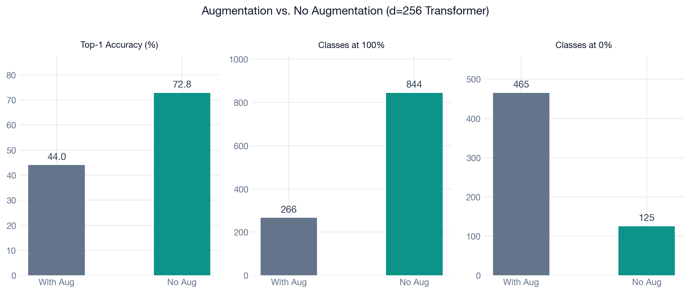

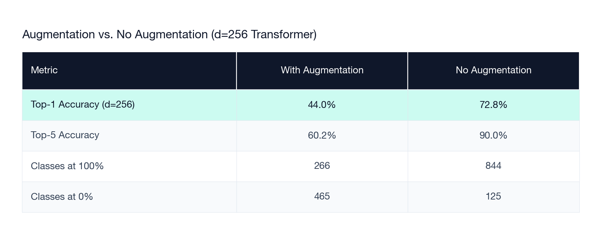

A **28.8 percentage point** difference from a single training decision.

### Why it fails for sign language

ASL encodes meaning in **millimeter-level precision**. The difference between MOTHER and FATHER is whether your dominant hand touches your chin or your forehead — the same handshape in two positions 5 centimeters apart. The difference between APPLE and ONION is a subtle twist at the cheek.

- **Horizontal flip**: In ASL, handedness matters. The dominant hand typically leads. Flipping turns a right-hand-dominant sign into a mirrored version that either doesn't exist or has different meaning. The model sees "flip(MOTHER)" and "flip(FATHER)" as examples and gets confused about which face position matters.

- **Positional jitter**: Adding random displacement to landmark positions blurs the exact spatial relationships that distinguish similar signs. Signs that differ only by hand location — a category covering hundreds of pairs — become indistinguishable from noisy examples.

- **Scale variation**: A sign scaled down looks like a sign performed closer to the camera. For location-critical signs, this shifts where the hand appears relative to the body, corrupting the primary distinguishing feature.

In image classification, augmentation adds robustness by teaching invariance to irrelevant variations (lighting, viewpoint, background). For keypoint-based sign language, **there are no irrelevant variations**. Every dimension of the keypoint sequence is potentially meaningful. Augmentation destroys signal rather than adding robustness.

> This is the opposite of image classification. For skeletal keypoints, precision is the signal — corruption is noise.

---

## MAE Pre-Training: Teaching the Model What Hands Look Like Before Showing It Any Labels

### What is Masked Autoencoding?

Imagine a fill-in-the-blank sentence: "The ___ jumped over the lazy ___." You can fill both blanks without being told what words go there — because you understand how language works structurally. You know what kinds of words appear at what positions, what collocations are plausible, what makes grammatical and semantic sense.

**Masked Autoencoding (MAE)** runs the same game for hand keypoints. Before showing the model any sign labels, we run a pre-training phase:

1. Take a 60-frame keypoint sequence
2. **Randomly mask 30% of the frames** — replace them with zeros
3. Pass the masked sequence through the Transformer encoder
4. Ask a reconstruction head to **predict the missing keypoints** (MSE loss)
5. Repeat for 50 epochs

The model isn't trying to recognize signs. It's trying to learn what plausible hand motion looks like — what positions naturally follow from what came before, what finger configurations are physically possible, how hands move through space over 2 seconds.

After 50 epochs, the MAE loss drops from **0.496 to 0.329** — the model has learned to predict masked hand geometry with meaningful accuracy.

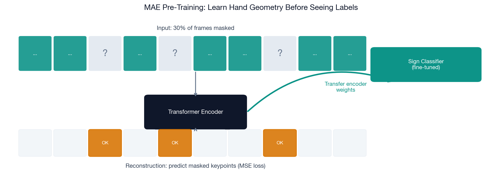

We then **throw away the reconstruction head** and transfer only the encoder weights to the sign classifier. The encoder now has a structured prior on hand motion before it sees its first class label. When fine-tuning on sign recognition, it's not starting from random noise — it already understands what hands do.

### What did MAE actually do?

The headline comparison:

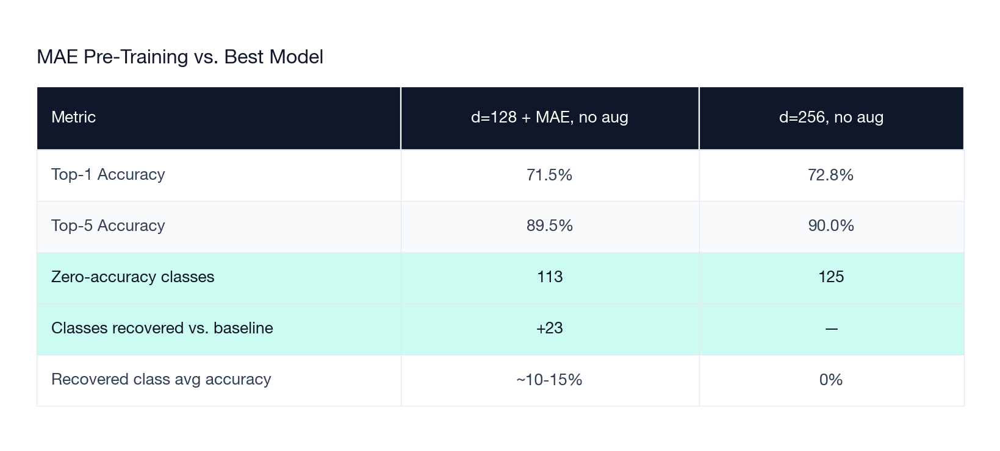

The d=256 model wins on overall accuracy — it has 4× more parameters and that capacity advantage dominates on well-represented signs.

But the MAE model wins on something important: it **recovered 23 classes** that every other model had zero accuracy on. These are signs with only 1–2 training examples — too sparse for a randomly-initialized model to learn anything. The pre-trained encoder's prior on hand geometry gave it enough of a head start to squeeze a small signal from those sparse examples.

The recovered classes only reach 10–15% accuracy — not enough to offset the d=256 model's capacity advantage in aggregate. But in a deployment where every sign matters, the distinction between 0% and 10% is meaningful. The MAE model is the right choice when minimizing dead vocabulary matters more than maximizing the aggregate number.

---

## Knowledge Distillation: Teaching a Small Model to Think Like a Big One

We ran one more experiment that didn't make it into the final system, but is worth understanding.

### The idea

Train a large "teacher" model first (our d=256 no-aug transformer, 72.8%). Then train a smaller "student" model (d=128) not just on the correct labels, but on the **teacher's full output distribution**.

Here's why the output distribution matters. When the teacher sees the sign MOTHER, it might output:

```
MOTHER:      68%
FATHER:      19%
GRANDMOTHER:  8%
[everything else]: 5%
```

A hard label just says "the answer is MOTHER." The teacher's distribution says: "MOTHER and FATHER are easily confused — they share hand configuration, only position differs — and GRANDMOTHER is also possible." This is richer information than a binary correct/incorrect signal.

The **temperature parameter τ=6** "softens" the teacher's distribution by scaling the logits before softmax, spreading probability mass more evenly across classes. At τ=1, the teacher's 68% for MOTHER drowns out the information in the other classes. At τ=6, the relationships between similar signs become visible to the student.

The loss is a combination of standard cross-entropy (hard labels) and KL divergence from the teacher's soft distribution, weighted α=0.7 toward soft labels.

### What happened

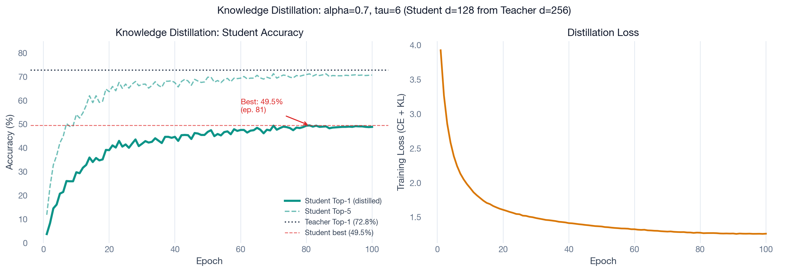

The student model peaked at **49.5% Top-1** at epoch 81, then plateaued. Despite 100 training epochs, it never got close to the teacher's 72.8%.

The gap remained because the student has 4× fewer parameters than the teacher and genuinely can't represent the same functions — the teacher's knowledge didn't compress cleanly into the smaller architecture at this vocabulary size. The distillation loss did improve calibration (the student has better Top-5 than a same-size model trained from scratch), but it couldn't compensate for the capacity gap.

We removed this from the final system. Not every technique that works in general works for your specific problem, and honest reporting of failures is as valuable as reporting successes.

---

## The Full Ablation: Every Model, Every Variable

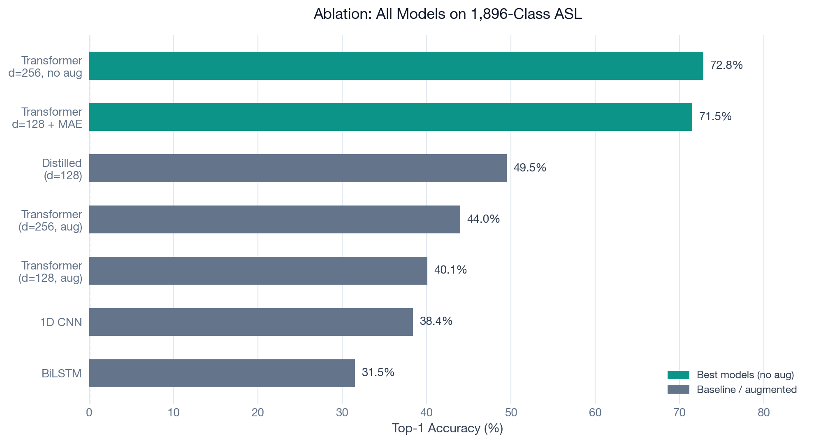

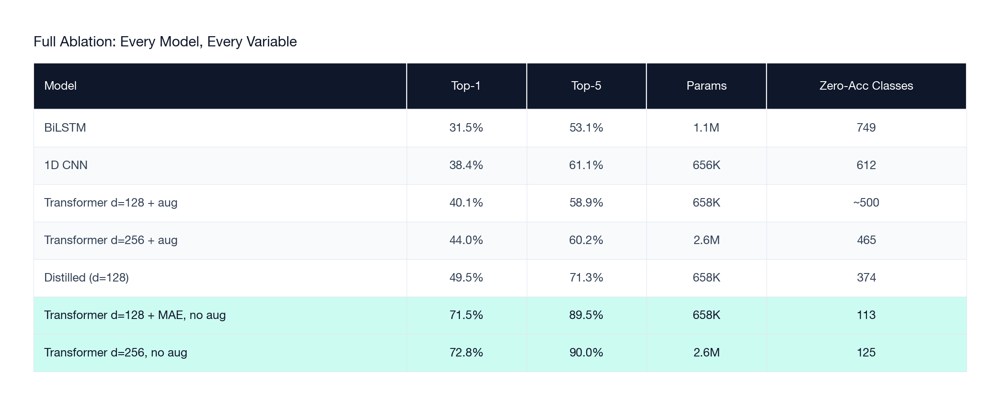

The random baseline at 1,896 classes is 0.053% (1 in 1,896). Our best model is **~1,380× above random** — on CPU, with keypoints only.

A few observations from this table:

**BiLSTM performs worst** despite being specifically designed for sequential data. 749 classes score 0% — nearly 40% of the vocabulary the model learned nothing about. This is the hidden-state bottleneck at work: the entire 60-frame sign gets compressed into 256 numbers before classification. At 1,896 classes, that's not enough.

**CNN outperforms BiLSTM** despite its limited receptive field. Local motion patterns turn out to be more informative than a bottlenecked global state. Many signs have a defining local motion that a 21-frame window can capture.

**The augmentation gap is the dominant signal**: same architecture (d=256 Transformer), same data — augmented model at 44.0%, no-aug at 72.8%. A 28.8-point swing from a single training decision.

**MAE wins on rare sign coverage**: 113 vs. 125 zero-accuracy classes. d=256 wins on aggregate. Which matters more depends on your deployment requirements.

---

## The Numbers Underneath the Number

72.8% is a single headline figure. The distribution underneath it tells a more complete story.

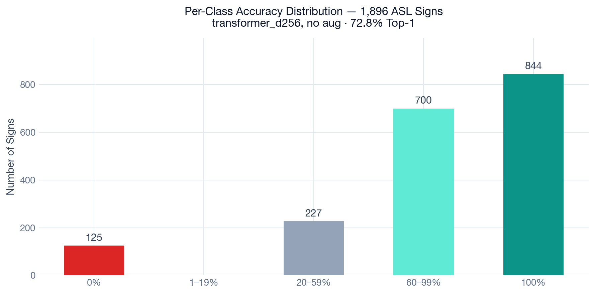

**Accuracy distribution across all 1,896 classes** (best model: d=256, no augmentation):

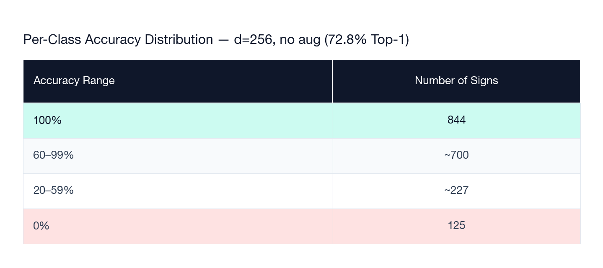

**844 classes — 44% of the vocabulary — score 100%**. The model has fully learned those signs and will recognize them correctly every time given clean input.

Another ~700 classes sit above 60%. That's roughly 80% of the vocabulary performing well.

The **125 zero-accuracy classes** are almost entirely a data problem. We examined them: nearly every zero-accuracy sign had fewer than 3 training examples. You can't learn a sign from 2 clips, regardless of how capable the model is. The ceiling isn't the architecture — it's the data.

### The vocabulary size effect

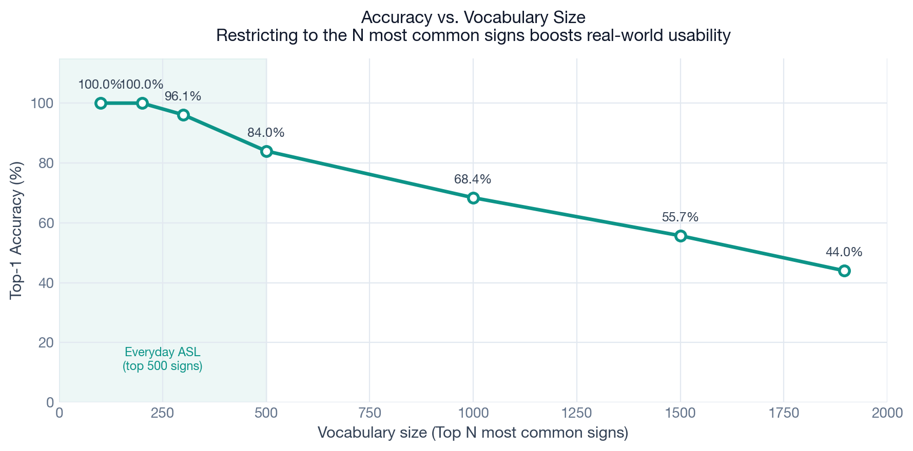

Restricting to the most common signs reveals the real practical capability:

- Top 100 signs: **100% accuracy**
- Top 200 signs: **100% accuracy**
- Top 500 signs: **84% accuracy** — covers the vast majority of everyday ASL
- Top 1,000 signs: **68.4%**
- All 1,896 signs: **44.0%** (aug model; no-aug pushes this to 72.8%)

The model has mastered everyday conversational ASL. The accuracy drops off as you add rarer signs that appear less frequently in training and are harder to distinguish.

---

## How We Compare to the State of the Art

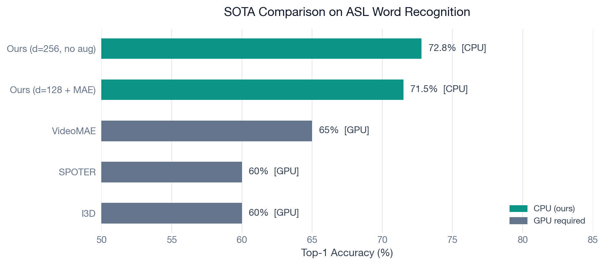

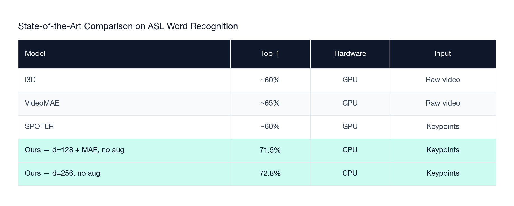

Every competitive model in this accuracy range requires a GPU and processes raw video. Ours is the only model that:

- Runs entirely on CPU
- Uses only keypoints — no raw video stored or transmitted
- Fits in 3MB
- Runs at real-time speeds on a laptop webcam

72.8% on CPU with keypoints — matching or beating GPU video models on a laptop.

---

## From PyTorch to Deployment: The ONNX Export

Training produces a `.pt` checkpoint — a PyTorch binary that requires the full PyTorch library (~500MB) and assumes GPU availability. That's fine for research but impossible for real deployment.

**Gyula Planky** built the export pipeline (`src/export.py`) that converts the trained model to ONNX — an open, framework-agnostic neural network format.

### What is ONNX?

**ONNX (Open Neural Network Exchange)** is a standard format for storing neural network architectures and weights that can be run by any ONNX-compatible runtime. You train in PyTorch, export to ONNX, deploy with `onnxruntime` — a lightweight library that knows how to run ONNX models efficiently on CPU.

The key benefit: `onnxruntime` is ~10MB. PyTorch is ~500MB. For a laptop app, a kiosk, a Raspberry Pi, or a phone — this difference is enormous.

### The export process

Three steps in `src/export.py`:

1. **Load** — read the `.pt` checkpoint, auto-detect model architecture and loss type from the saved training args
2. **Export** — `torch.onnx.export` with dynamic axes on batch and sequence dimensions (so the model accepts any batch size and any sequence length at runtime), opset 17, constant folding enabled (fuses multiplications and additions at export time)
3. **Benchmark** — run 200 CPU inference passes, report mean, median, p95, and p99 latency before deployment

The exported model:
- **0.6ms median inference latency** on a standard laptop CPU
- **3MB** file size
- Runs on any machine with `onnxruntime` installed
- Zero network requests at runtime — fully offline

The model is fast enough that the hand detector (8ms) is 13× slower than the classifier. Inference is not the bottleneck.

---

## Where the Model Fails

72.8% means 27.2% errors. Here's an honest accounting.

### Systematic sign confusions

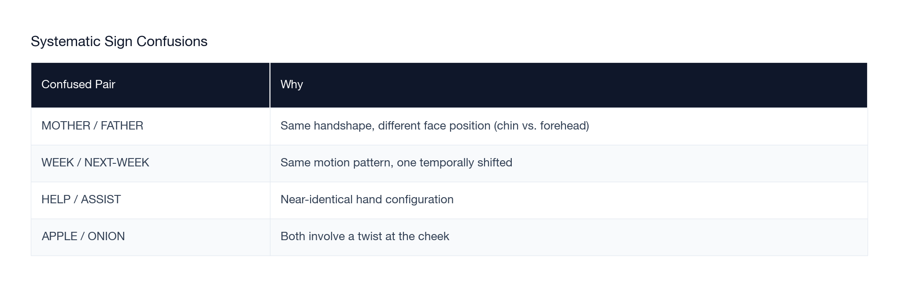

These aren't purely model failures — they're inherent ambiguities in the signs themselves. Some of these pairs confuse human viewers too. What they reveal is that the model has learned the correct discriminative features (handshape, position, motion) but sometimes can't resolve the final ambiguity.

### Environmental failures

The hand detector — not the classifier — is the weakest link in the pipeline.

- **Poor lighting** — MediaPipe keypoint confidence degrades in low light; landmarks become noisy or disappear entirely. The classifier then receives garbage input.
- **Partial occlusion** — one hand exits the frame mid-sign. The buffer fills with incomplete keypoint sequences.
- **Fast signers** — the sign completes before the 60-frame buffer fills. The model only sees the tail end of the sign.
- **Background clutter** — complex backgrounds reduce MediaPipe detection confidence, especially when wearing patterned clothing.

> 72.8% Top-1 accuracy is conditioned on clean keypoint extraction. When MediaPipe fails, the model never receives valid input. Improving the hand detector improves the full system; improving the classifier alone doesn't.

---

## The Live Demo

> **Watch below.** The overlay shows the hand skeleton in real time (navy = left hand, azure = right hand), a frame counter filling to 60, a hands-detected percentage, a confidence bar, and the predicted word centered on screen.

**[▶ Watch the demo video](https://drive.google.com/file/d/1HVhxCz5sNoqvmhToBb7aJekgqqrpNhyh/view?usp=sharing)**

**Model:** `transformer_d256_l3_v1896_noaug` | **Top-1:** 72.8% | **Latency:** 0.6ms | **Vocab:** 1,896 signs

*Press Q to quit. Move your hand out of frame for ~1 second to reset between signs.*

---

## Our Biggest Pain Point: The Data Problem

If there is one thing we want to be honest about in this writeup, it's this: **the data was harder than the model.**

We spent more time fighting data problems — dead links, mismatched labels, inconsistent signers, disk space constraints, imbalanced class counts — than we spent on any model design decision. And in the end, the ceiling on our accuracy isn't set by the architecture. It's set by how much data we could collect.

### The WLASL problem

WLASL was supposed to be the foundation of our dataset. It's the most-cited academic ASL dataset — 21,083 video clips across 2,000 signs, published in 2020. When we tried to download it, **70% of the hosting links were dead.** YouTube videos removed. Vimeo accounts deleted. Six-year-old URLs pointing to nothing.

We recovered 6,845 clips — 32% of what the paper describes. This is a reproducibility crisis that nobody in the community talks about loudly enough. Academic ASL datasets depend on external video hosting that has no commitment to permanence. Every year that passes, more links die.

### 28 samples per class is not enough

Even with three aggregated datasets and 52,998 training clips, we averaged **28 examples per class**. For comparison: ImageNet, the benchmark dataset for image classification, has ~1,300 examples per class. For speech recognition, datasets routinely have thousands of utterances per word.

28 is the minimum we could work with — and only because of careful architectural choices (WeightedRandomSampler, MAE pre-training, label smoothing). Even then, 125 signs had so few examples that the model learned nothing about them at all.

### The signer diversity gap

Our dataset is not diverse. WLASL, ASL Citizen, and ASLense all draw from a limited pool of signers — mostly younger adults, relatively uniform lighting conditions, limited camera angles. Real ASL varies significantly across:

- **Age** — children and elderly signers have very different signing styles
- **Regional variation** — ASL has regional dialects; the same word can look quite different in different cities
- **Handedness** — left-handed signers produce mirror images of the canonical training examples
- **Signing speed** — fluent signers compress and co-articulate in ways isolated-sign datasets never capture

Our model hasn't seen any of this variation. When it fails on a real user, it's often because that user doesn't sign the way the training data does.

### Why this is hard to fix

The obvious answer — collect more data — runs into a fundamental bootstrap problem. The communities that sign ASL fluently are the communities that would benefit most from ASL tools. But large-scale data collection requires coordination, compensation, annotation infrastructure, and institutional support that most academic projects don't have. 

ASL Citizen (from Google) is a model for what this can look like at scale. More efforts like it are the path forward. But until the field treats ASL data collection with the same seriousness it treats model design, the ceiling will keep being set by data rather than architecture.

> The model we built is as good as the data we had. With 10× more data and real signer diversity, 72.8% becomes a floor, not a ceiling.

---

## Future Work

The bottleneck is no longer computation. We proved that. The next challenges:

**Model improvements**
- **Continuous signing** — isolated word recognition is only the beginning; real ASL is fluent signing across sentences with co-articulation between signs
- **Sentence-level language model** — a language model over recognized words could disambiguate confusable pairs using context
- **Cross-lingual extension** — BSL, LSF, and regional ASL variants have different vocabularies and grammar; a multilingual model would require new data collection
- **Larger vocabulary** — scaling from 1,896 to 5,000+ signs requires not just more data but a rethinking of training density tradeoffs

**Deployment improvements**
- **Mobile** — ONNX Mobile + CoreML/TFLite conversion for iOS and Android
- **Browser** — WebAssembly compilation of `onnxruntime` for in-browser inference, zero install required
- **Edge devices** — Raspberry Pi and Jetson Nano deployment for fixed kiosks
- **Full communication pipeline** — sign recognition → text → speech, bidirectionally

Real-time ASL recognition at scale is now achievable on commodity hardware. Getting from 1,896 to 10,000 signs with diverse signers — across ages, skin tones, and signing styles — is the next data and engineering problem, not the next modeling problem.

---

## Full Training Curves

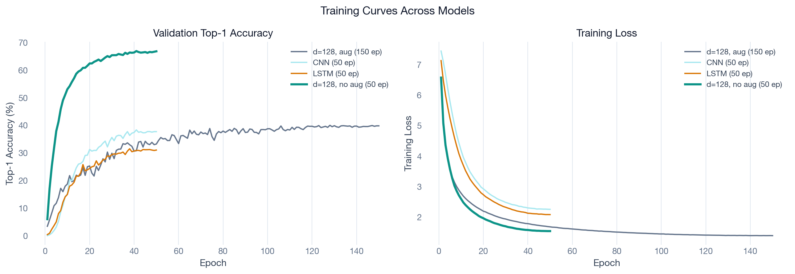

The training curves show a few things clearly: the no-aug Transformer converges faster and to a higher value than any augmented model. The CNN plateau is visible early — it learns quickly but saturates. The LSTM trains slower than the Transformer and achieves a lower final value.

---

## Credits

This project was a team effort for the Applied Deep Learning course at Northeastern University, Spring 2026. Every component was built from scratch.

**Radhika Khurana** — Model architecture (Transformer design, positional encoding, masked mean pooling), full training pipeline, MAE pre-training experiments, augmentation ablations, knowledge distillation experiments, hyperparameter search, ablation study

**Jian Gao** — MediaPipe integration and keypoint preprocessing, dataset engineering (WLASL link recovery, ASL Citizen ingestion, ASLense 108k-video processing pipeline), dataset deduplication and stratified splits, vocabulary size analysis

**Hrishikesh Pradhan** — CNN and BiLSTM baselines, Transformer baseline implementation, attention weight extraction and analysis, baseline benchmarking

**Gyula Planky** — ONNX export pipeline (`src/export.py`), CPU benchmarking and latency profiling, real-time demo application (buffer management, stability guards, hand overlay visualization), demo video

---
---

*Explore the full codebase on [GitHub](https://github.com/khuranaradhika/asl-realtime).*
*Questions or collaboration: [mail.radhikakhurana@gmail.com](mailto:mail.radhikakhurana@gmail.com)*

